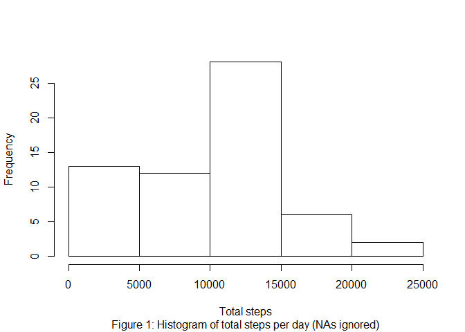
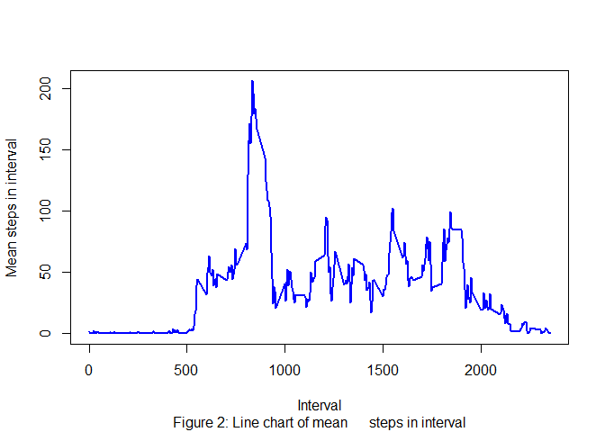
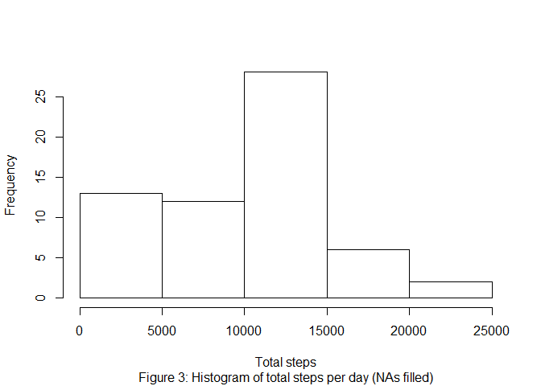
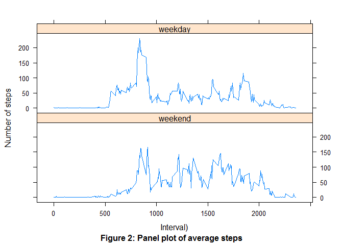

<span style="color:red">
  Comment: "This solution is programmed to be as instructive as possible. I know that there exist more efficient options. However, I choose a solution that is      easy to read and therefore inefficient to a certain extend."
</span>.


#Loading and preprocessing the data
Show any code that is needed to

#### 1. Load the data (i.e. read.csv())

```r
  data<-read.csv("https://raw.githubusercontent.com/Fabian-Friese/RepData_PeerAssessment1/master/activity.csv")
```
#### 2. Process/transform the data (if necessary) into a format suitable for your analysis

```r
  library(data.table)
  DT<- as.data.table(data)
```

# What is mean total number of steps taken per day?
For this part of the assignment, you can ignore the missing values in the dataset.

#### 1. Make a histogram of the total number of steps taken each day

```r
  DT<-DT[,day_steps:= sum(steps,na.rm = TRUE),by=date]
  DT_DAY<-unique(DT[ ,c(2,4) ])
  hist(DT_DAY$day_steps,sub="Figure 1: Histogram of total steps per day (NAs ignored)", main="",xlab="Total steps")
```

<!-- -->

#### 2. Calculate and report the mean and median total number of steps taken per day

```r
  mean(DT_DAY$day_steps)
```

```
## [1] 9354.23
```

```r
  median(DT_DAY$day_steps)
```

```
## [1] 10395
```

#What is the average daily activity pattern?
#### 1. Make a time series plot (i.e. type = "l") of the 5-minute interval (x-axis) and the average number of steps taken, averaged across all days (y-axis)

```r
  DT<-DT[,interval_steps:= mean(steps,na.rm = TRUE),by=interval]
  DT_INTERVAL<-unique(DT[ ,c(3,5) ])
  plot(DT_INTERVAL$interval, DT_INTERVAL$interval_steps, type='l',xlab='Interval' , ylab='Mean steps in interval' ,col='blue', sub="Figure 2: Line chart of mean      steps in interval",lwd=2)
```

<!-- -->

#### 2. Which 5-minute interval, on average across all the days in the dataset, contains the maximum number of steps?

```r
  as.numeric(head(DT_INTERVAL[order(interval_steps,decreasing=TRUE)],n=1)$interval)
```

```
## [1] 835
```

#Imputing missing values
Note that there are a number of days/intervals where there are missing values (coded as NA). The presence of missing days may introduce bias into some calculations or summaries of the data.

#### 1. Calculate and report the total number of missing values in the dataset (i.e. the total number of rows with NAs)

```r
  sum(is.na(DT))
```

```
## [1] 2304
```

#### 2. Devise a strategy for filling in all of the missing values in the dataset. The strategy does not need to be sophisticated. For example, you could use the mean/median for that day, or the mean for that 5-minute interval, etc.

```r
  within(DT,
     steps <- ifelse(is.na(steps),interval_steps,steps)
  )
```

```
##            steps       date interval day_steps interval_steps
##     1: 1.7169811 2012-10-01        0         0      1.7169811
##     2: 0.3396226 2012-10-01        5         0      0.3396226
##     3: 0.1320755 2012-10-01       10         0      0.1320755
##     4: 0.1509434 2012-10-01       15         0      0.1509434
##     5: 0.0754717 2012-10-01       20         0      0.0754717
##    ---                                                       
## 17564: 4.6981132 2012-11-30     2335         0      4.6981132
## 17565: 3.3018868 2012-11-30     2340         0      3.3018868
## 17566: 0.6415094 2012-11-30     2345         0      0.6415094
## 17567: 0.2264151 2012-11-30     2350         0      0.2264151
## 17568: 1.0754717 2012-11-30     2355         0      1.0754717
```

#### 3. Create a new dataset that is equal to the original dataset but with the missing data filled in.

```r
  DT_FILLED<-within(DT,
     steps <- ifelse(is.na(steps),interval_steps,steps)
  )
```

#### 4. Make a histogram of the total number of steps taken each day and Calculate and report the mean and median total number of steps taken per day. Do these values differ from the estimates from the first part of the assignment? What is the impact of imputing missing data on the estimates of the total daily number of steps?

```r
  DT_DAY_FILLED<-unique(DT_FILLED[ ,c(2,4) ])
  hist(DT_DAY_FILLED$day_steps, sub="Figure 3: Histogram of total steps per day (NAs filled)", main="",xlab="Total steps")
```

<!-- -->

```r
  mean(DT_DAY_FILLED$day_steps)
```

```
## [1] 9354.23
```

```r
  median(DT_DAY_FILLED$day_steps)
```

```
## [1] 10395
```


#Are there differences in activity patterns between weekdays and weekends?
For this part the weekdays() function may be of some help here. Use the dataset with the filled-in missing values for this part.

#### 1. Create a new factor variable in the dataset with two levels – “weekday” and “weekend” indicating whether a given date is a weekday or weekend day.

```r
  Sys.setlocale("LC_ALL","English")
```

```
## [1] "LC_COLLATE=English_United States.1252;LC_CTYPE=English_United States.1252;LC_MONETARY=English_United States.1252;LC_NUMERIC=C;LC_TIME=English_United States.1252"
```

```r
  DT_FILLED[,weekday:=weekdays(as.Date(date))]
  DT_FILLED<-within(DT_FILLED,
     weekday <- ifelse(weekday=='Sunday'|weekday=='Saturday','weekend','weekday')
  )
  
  DT_FILLED <- DT_FILLED[,interval_steps_weekday:= mean(steps),by=.(interval,weekday)]
  
  DT_FILLED_UNIQUE <- unique(DT_FILLED[ ,c(3,6,7) ])
```

#### 2. Make a panel plot containing a time series plot (i.e. type = "l") of the 5-minute interval (x-axis) and the average number of steps taken, averaged across all weekday days or weekend days (y-axis).


```r
  library (lattice)
  xyplot (interval_steps_weekday ~ interval | weekday, data=DT_FILLED_UNIQUE, type='l',
          layout=c(1, 2), as.table=T, xlab="Interval)", ylab="Number of steps", sub= "Figure 2: Panel plot of average steps")
```

<!-- -->

